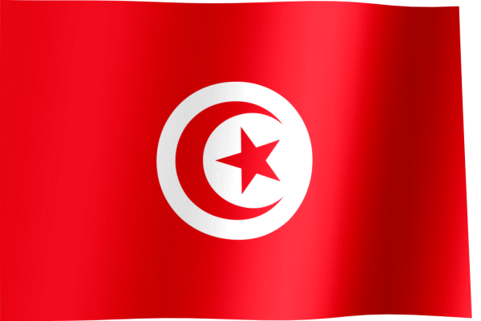

# المصدر المفتوح التونسي 

منصة مفتوحة المصدر تم إنشاؤها لدعم وتطوير مجتمع المطورين التونسيين.

## المشاركة
ندعو كل مطور تونسي للانضمام إلينا والمساهمة في تطوير هذه المنصة. لنبادر معًا في تحسين عالمنا والارتقاء به! 🚀

## الدعم
دعمك يساهم بتحسين مجتمع المطورين التونسيين لذلك يمكنك دعما بوسائل عديدة:
 - مشاركة المشاريع المفتوحة المصدر التونسية على وسائل التواصل الاجتماعي.
 - المساهمة في أرشفة هذه المشاريع
 - مشاركة هذه المنصة مع المطورين التونسيين.
 - المشاركة بعمل Issues أو Pull Requests للمستودعات البرمجية.

## الأهداف
- تعزيز ثقافة المصدر المفتوح بين المطورين التونسيين.
- دعم المطورين التونسيين في بناء مشاريع مفتوحة المصدر ونشرها.
- إنشاء مجتمع قوي يتبادل الخبرات والمعرفة في مجال البرمجيات مفتوحة المصدر.
- تسليط الضوء على إبداعات المطورين التونسيين محليًا ودوليًا.
- تسهيل التعاون بين المطورين على مشاريع مفتوحة المصدر لتحسين المهارات وتعزيز التواصل.

## شكر وتقدير
  - في الحقيقة لقد ألهمتنا [منصة Yemen Open Source](https://github.com/YemenOpenSource). لبدء منصتنا كي يستفيد منها المطورين التونسيين.
 

# Tunisian Open Source 

An open-source platform created to support and develop the Tunisian developer community.

## Participation
We invite every Tunisian developer to join us and contribute to the development of this platform. Let’s take the initiative together to improve our world and elevate it! 🚀

## Support
Your support helps improve the Tunisian developer community, and there are many ways to contribute:
- Share Tunisian open-source projects on social media.
- Help archive these projects.
- Share this platform with Tunisian developers.
- Participate by creating Issues or submitting Pull Requests to the repositories.

## Goals
- Promote the culture of open source among Tunisian developers.
- Support Tunisian developers in building and publishing open-source projects.
- Build a strong community to exchange expertise and knowledge in open-source software.
- Highlight the creativity of Tunisian developers both locally and internationally.
- Facilitate collaboration among developers on open-source projects to enhance skills and strengthen communication.

## Acknowledgment
- We were truly inspired by the [Yemen Open Source Platform](https://github.com/YemenOpenSource) to start our own platform for the benefit of Tunisian developers.
